<h1 align="center">Project One for Code Institute | Chefs-Shop  - HTML & CSS</h1>

[Click here to view live page.](https://emmy-dare274.github.io/EmmyPP1-Chefs-Shop/) 
<!-- add link to the website picture here -->

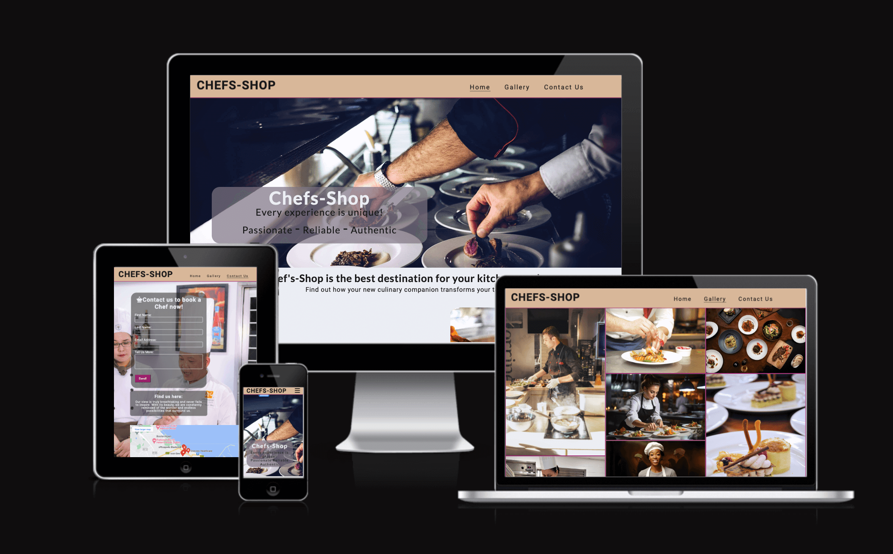

Chefs-Shop is a website that I built as part of my training to become a Full Stack Web Developer with [Code Institute](https://codeinstitute.net/). This project allowed me to showcase my skills in both HTML and CSS.

To do this and simplify culinary needs, I created a one-stop online shop for expert chefs where users are connected with expert chefs who are ready to meet all of their culinary needs.

## Table of Content

Open the Table of Contents here 

[About the project](#about-the-project) 

[Target audience](#target-audience)

[User Experience UX](#user-experience-ux)

 - [User stories](#user-stories)
 - [Design](#design)

[Typography](#typography)
- [Background](#background)

[Features](#features)

 - [Composition of the Website](#composition-of-the-website)
 - [Responsive devices](#responsive-devices)
 - [Animations](#animations)

## About the project

I created this responsive Chefs-Shop website to practice, develop, and demonstrate my HTML and CSS skills. Chefs-Shop is an invented online shop that offers users access to various internationally experienced ready-to-go chefs. I have chosen this theme as I feel the need for such a place to exist where one can click and access a chef who can prepare different kinds of meals, whether for a small or large kitchen, from soups and meat dishes to sweet treats and party nibbles. This theme was an obvious choice for me due to my insatiable love for food and my constant desire to explore diverse cuisines from around the globe. I am an avid cook myself and have been experimenting with various dishes from Turkish, Italian, Asian, African, and English cuisines. This venue is the perfect platform to bring together people in this profession who share this passion for cooking, allowing them to showcase their creativity and culinary skills in front of a live audience.

However, my primary objective for building this website is to enhance my skills in HTML and CSS. These two languages are crucial for achieving my ultimate goal, so I am exploring all the features I know to create this project. While I have used JavaScript in some instances for specific functionalities, my focus has been on HTML and CSS.

## Target audience

The target audience for Chefs-Shop are those who desire a unique culinary experience in the comfort of their own home. This includes both small and large kitchens that may receive unexpected guests without a chef on hand.

In addition, Chefs-Shop is targeted at aspiring and freelancing chefs who would like to join the team of chefs to provide top-quality services to clients worldwide. Some of the characteristics of Chefs-Shop chefs include but are not limited to:

 1. Experiment with color and texture.
 2. Plan ahead, prepare and organize.
 3. Choosing the perfect plate.
 4. Develop and plan menus and daily specials.
 5. Using the right tools for food plating.
 6. Getting the best ingredient that matches every recipe.
 7. Maintaining the standards for food storage, rotation, quality, and appearance.
 8. Ensuring compliance with applicable health codes and regulations.

By carefully considering the needs of our users, I crafted a website that boasts a visually striking design, sure to captivate and entice visitors. This is in a bid to give the impression that this culinary destination will leave a lasting impression and keep users coming back for more.

## User Experience UX

 ### User stories

- ### First Time Visitors

  - As a first time user, I am looking for what the site has to offer.

  - As a first time user, how accessible is the site and its services.

  - As a first time user, does the content of the site motivate and meet my search goal?
  - As a first time user, I would like to contact the site for business enquries.

- ### Returning Visitors

  - As a returning user, I want to find a feedback form.

  - As a returning user, I want to find out about other services and recommendation.

  - As a returning user, I want to be part of the Chefs team.

- ### Frequent Visitors

  - As a frequent user, are there new update to the site such as promotions and additional features.

  - As a frequent user, is there a physical location and contact address.

 ### Design

 Theme colors were selected from Mycolor Space palettes (see credits) and enhanced with Red-Green-Blue to stimulate creativity.

 #### Color Scheme
  -  The website predominantly uses the colour Tan (#D9B799) to maintain a simple and uniform           appearance. The Tan colour signifies high quality and helps the users to comfortably read the information presented on the screen. A deep Purple hue was overlaid onto the pages' Tan background, representing royalty and excellence.
  Also, the website uses the color Bright Gray on its body, which creates a mild and coherent, user-friendly look.

  - The logo, cover text overlay, responsive buttons, and social media icons all use a Chinese black color. This color was chosen for its attractive and soothing qualities, which provide a comfortable reading experience for users. These design choices ensure that users can easily navigate through the content with ease.

## Typography

- #### Background
  I added a background image to the webpage to create a 3D effect and to make it appear as though the background is touchable around the heading area. As users will be searching for content such as pictures to showcase culinary events at first glance, I opted for a background that is visually appealing and gives the right impression.

  For consistency, the sticky headings and fixed footer use the same background color as the rest of the page, with a transparent top color for subtle content viewing.

- #### Fonts
  The fonts Roboto and Lato were mainly used for the body text on small, medium-sized, and large screens. This was because these fonts gave the impression of attractiveness and readability. For accessibility reasons, I chose the more readable Lato font over other cursive fonts. Sans-Serif fonts were chosen as fallback fonts.
  This combination not only creates a clean look but also adds an artistic touch that elevates the overall aesthetic.

  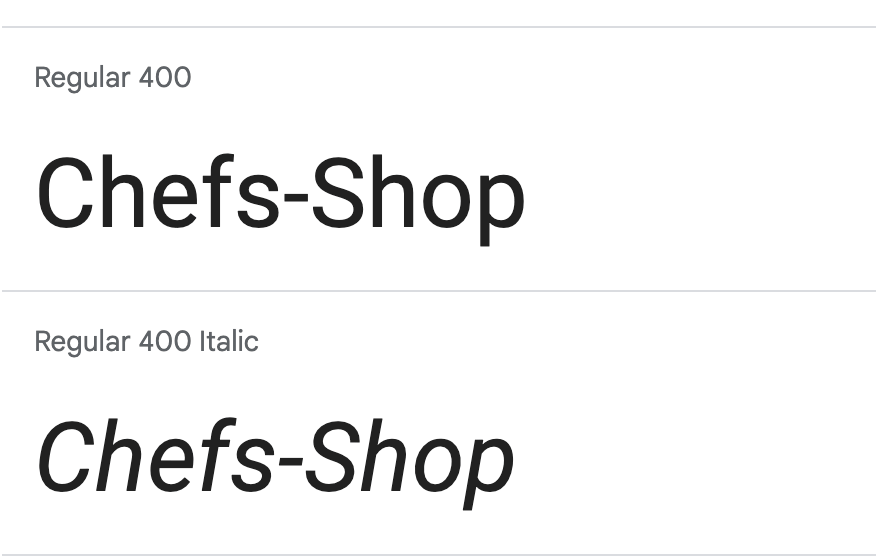

  - Roboto Google fonts were used for the main logo and headings to be visually appealing while also   maintaining accessibility.

  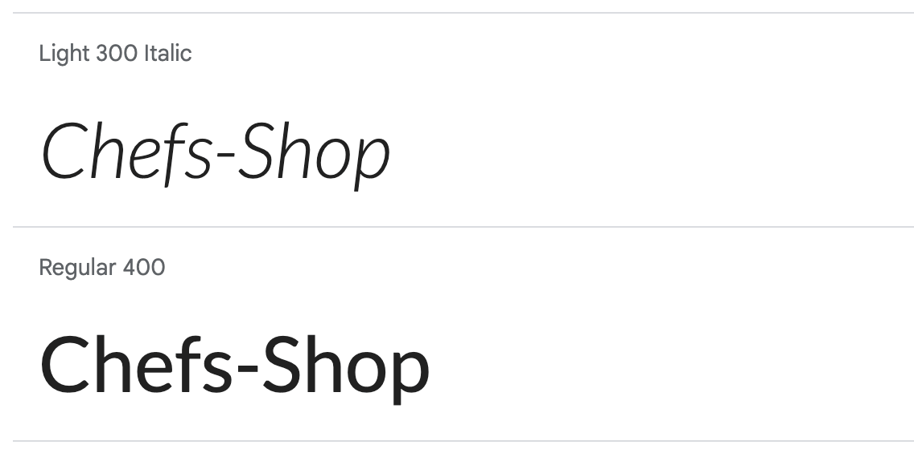

  - I opted to use the Lato font as the main font of the website due to its excellent accessibility and readability features.

## Features

  ### Composition of the Website
  The website is organized into three distinct web pages, accessible through a link in the header navbar. Users can easily navigate between pages such as the Home page, Gallery page, and Contact Us page. The website's structure provides a smooth and efficient user experience.

  - ### Landing page
    The landing page consists of a logo in the sticky header, followed by a cover with a background image, 4 sections and a footer.
    The purpose of this page is to introduce Chefs-Shop (section "Introductory"), to provide an appealing view of a chef preparing meals (section "about Chefs-Shop"), (section “Why Hire Us”) has a fixed background image showing food being prepared is to provide the quality of service users can get and a catchy event taken place, (section “What we offer:”) has an image with a chef portioning food and text to communicate Chefs-Shop services. a section that communicates the services users can get with an image, a section about a catchy meal prepared by chefs with text, a section that showcases an image of a chef cooking with text, a section that gives users the guarantee of quality services and customer-ready response, and lastly the (footer section) displays social media links where users can further catch a glimpse of Chefs-Shop activity on the different platforms like Facebook, LinkedIn, Twitter, Instagram, YouTube and TikTok. Following this is the footer and copyright information.

    

    
Image of the Landing page 

    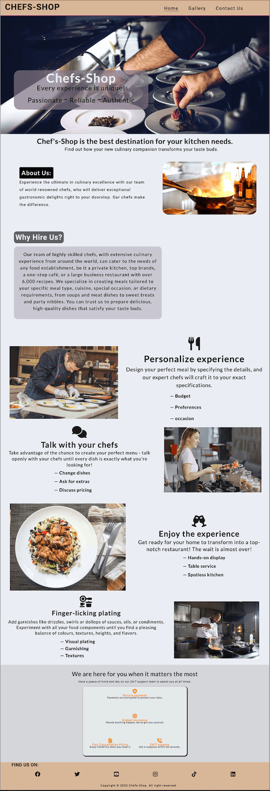

    

  - ### Navbar
    The purpose of the navigation bar and footer is to assist users in navigating the website smoothly and efficiently. The footer also provides links to relevant social media sites, which open in new tabs to ensure a seamless browsing experience.

     - The nav bar is located at the top of the page.
     - Within the nav bar there is the logo of Chef-Shop which navigates to the landing page on a click.
     - The nav bar also contains three links on the right hand side:
        * <strong>HOME:</strong> After clicking on it, the user will be redirected to the Home page. From there, they will be able to browse through several sections including 'About Us', 'Why Hire Us', and the services and policies offered by Chefs-Shop. The page also consists of a footer that contains links to the company's social media pages.
        * <strong>GALLERY:</strong> The gallery is where you can find an assortment of pictures showcasing different chefs in action in the kitchen, using a variety of cooking equipment and preparing a wide range of delicious meals.
        * <strong>CONTACT US:</strong> This leads the user to the Contact Us page, where they can book a chef service, request additional services, or receive a callback for further information.

    - The Home page, Gallery page and the Contact Us page links have an animated mouse hover effect.
  
    - The navigation is well-organized and easy to understand, making it simple for the user to navigate through the website:

    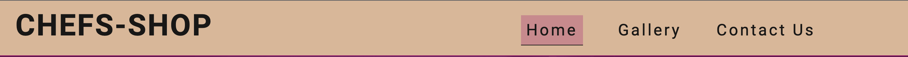

    - The website's navigation bar is designed to be responsive on smaller screens, such as mobile devices. On these smaller screens, a burger icon menu is displayed on the right side of the navbar. When the user clicks on this icon, a dropdown menu appears with links to the Home, Gallery, and Contact Us pages. This ensures that users can easily navigate the website, regardless of the device they are using.

      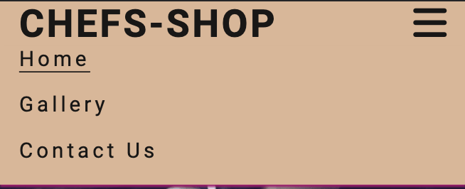

  - ### Home page
      

     
Image of Home page 

      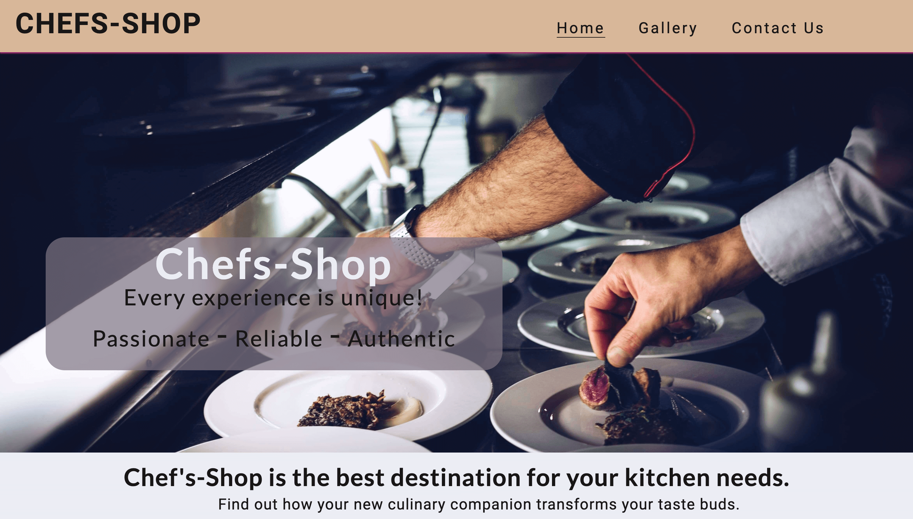
     

     When designing the homepage, my goal was to immediately capture users' attention and convey the purpose of the website. To achieve this, I selected an image cover featuring a chef's hand preparing a meal on display. I chose a photo that clearly illustrates the page's purpose upon visiting it.

  - ### Gallery page
    

    
Image of Gallery page 
 
    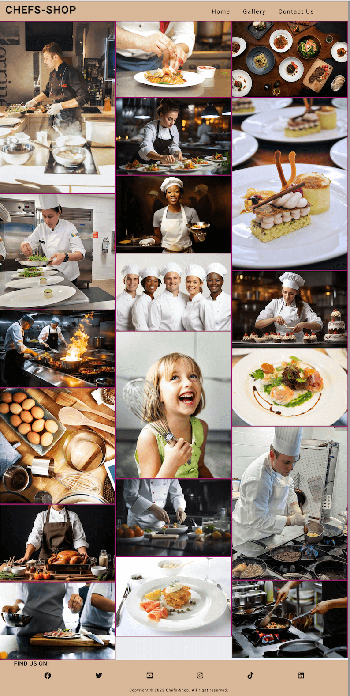
    

    The Gallery page comprises a header, different images in the body, and a footer. The primary aim of this page is to showcase the creativity of Chefs-Shop and its versatility with different types of food to attract and entice users with mouthwatering food images and Chefs on display.

    

  - ### Contact Us page
     

     
Image of the Contact Us page 
 
     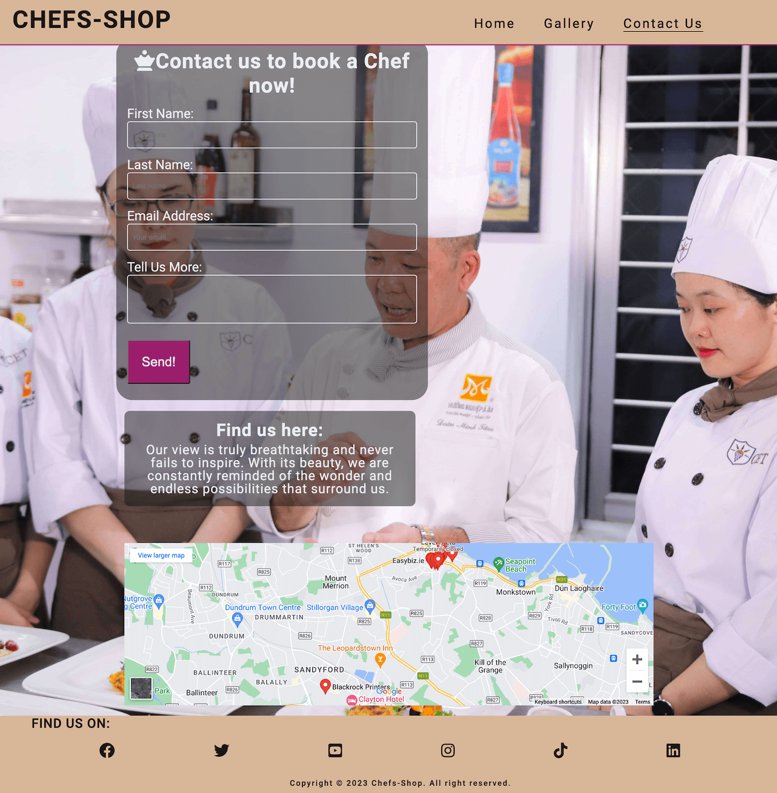
      

      The Contact Us page comprises a header, along with form sections for First Name, Last name, Email, and Comment to provide more details on the requested services, a message section to find the company's location on a map, followed by a google map and a footer. The primary objective of this page is to enable users to send a message to book a chef or request services and also to locate the physical address of the site on Google Maps.
  
  - ### Response page

    

     
Image of Response page 
 
     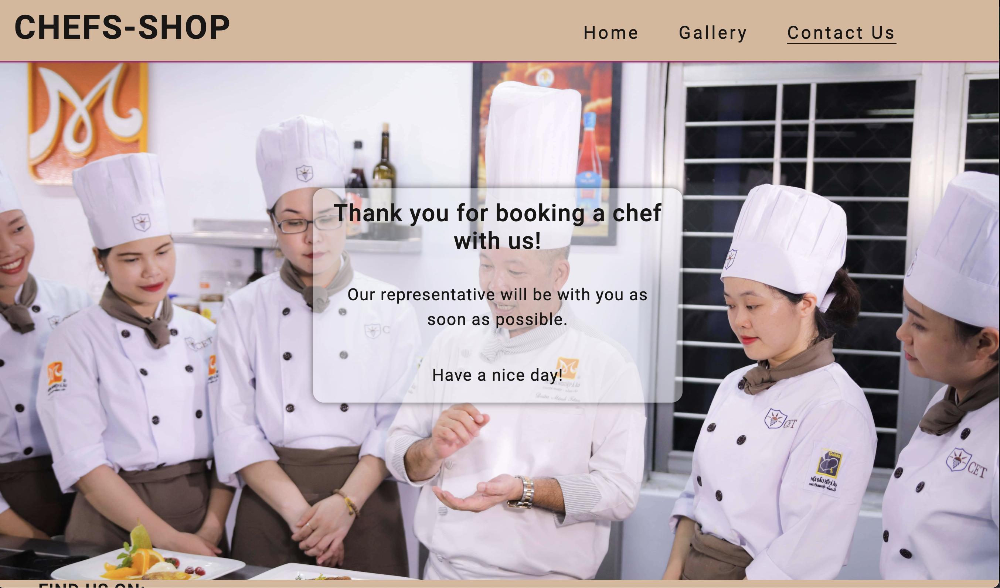
      

    Once the user has filled in all the required fields on the Contact Us page and clicked the <em>Send</em> button, they are immediately directed to the response page. This page contains a short message expressing gratitude, followed by a notification that they will be contacted soon after their information has been received.
    
    The response page then automatically redirects the user to the homepage after ten seconds.

  - ### Footer
    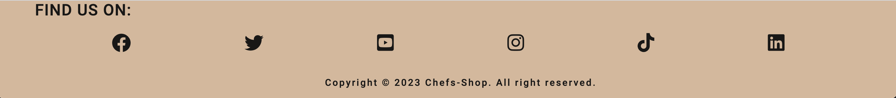

    The footer section contains icons of the social media pages of Chefs-Shop and a copyright information. The users are directed to a new window when clicked on the icons.

  - ### Responsive devices
    The website has been designed to be responsive and easily accessible on any device. For instance, when viewed on a phone screen, the navigation bar is replaced by a burger icon button, making it easier to navigate. Additionally, the text in some sections has been modified to fit the screen size, ensuring that users get complete information regardless of the device they are using. This approach allows laptop and desktop users to access detailed information while phone users can focus on the main information.

  - ### Animations
    To enhance the user experience, the website has minimal animation. However, to make navigation easier, the links in the navigation bar change their background color and padding when the mouse hovers over them while the text goes underlined simultaneously.

  - ### Positioning
    I have made sure to carefully position the elements on every page, including the Home page, Gallery page, and Contact Us page, to ensure the best possible user experience and accessibility.

## Future feature

  - I want to make the website more interactive and accessible.
  - I want the Navbar links to have a background effect that stays active on the page.

  - I want to make the video as a background fixed video.

  - Make the website quality stand out with different interactives.

## Future improvement

  - I would like to add more content to my Home page. Specifically, I want to make the images and text stand out by placing them in different positions. I also want to add figure captions to my Gallery images, so when the user hovers over the images, styled figure captions will appear and give the user more information about the benefits that Chefs-Shop offers.

  - I need the interactive map to be more prominent and visually appealing on all devices.

## Technology used

- [HTML](https://developer.mozilla.org/en-US/docs/Web/HTML) | was used to build the structure of the website.

- [CSS](https://developer.mozilla.org/en-US/docs/Web/css) | was used to add style to the HTML making the website presentable.

- [CSS Flexbox](https://developer.mozilla.org/en-US/docs/Learn/CSS/CSS_layout/Flexbox) | was used to arrnage items on the webpage.

- [VS Code](https://code.visualstudio.com/) | was used as the IDE to write, edit, and push codes.

- [Git](https://git-scm.com/) | was used for the version control of the website.

- [GitHub](https://github.com/) | was used to host the code of the website and for deployment.

- [Color Name](https://www.color-name.com/) | was used to detect color names.

- [Colorrrs](https://www.webfx.com/web-design/random-color-picker/) | was used to convert HEX color to RGB.

## Tools

  - [Pexels](https://www.pexels.com/) | was used to get images for website.

  - [Unsplash](https://unsplash.com/) | was used to get images for website.

  - [Rawpixel](https://www.rawpixel.com/) | was used to get images for website.

  - [Colorspace](https://mycolor.space/?hex=%2336194B&sub=1) | was used to choose colors for website.

  - [Compressor](https://compressor.io/) | was used to optimise images for website.

  - [Font Awesome](https://fontawesome.com/) | was used to select icons for website.

  - [I Am Responsive](https://ui.dev/amiresponsive) | was used to check website responsiveness on all devices.

  - [Tiny](https://tinypng.com/) | was used to optimise images for website.

  - [Google Map API](https://www.googlemapsiframegenerator.com/) | was used to generate map codes for website.

  - [MS Word](https://en.wikipedia.org/wiki/Microsoft_Word) | used to correct the grammar

## Testing

  - ### Code Validation and Testing

    - #### HTML
      - ##### Home page
      - The official W3C validator tool did not detect any errors or warnings during the validation process.

      - [W3C Markup Validation Result |Home page](https://validator.w3.org/nu/?showsource=yes&doc=https%3A%2F%2Femmy-dare274.github.io%2FEmmyPP1-Chefs-Shop%2Findex.html) | Home page validated without error.

       

         
Home page result 
 
         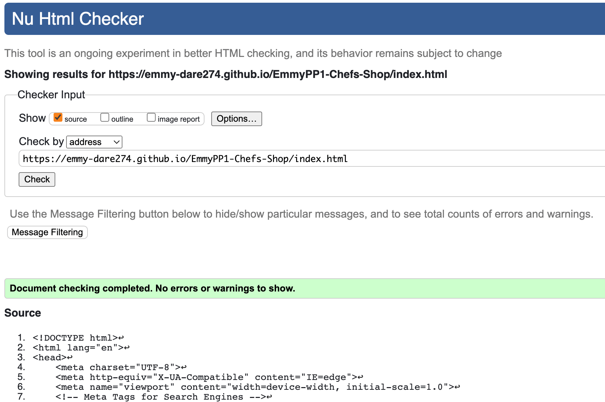

       

        - ##### Gallery page

      - The official W3C validator tool did not detect any errors or warnings during the validation process.

      - [W3C Markup Validation Result |Gallery page](https://validator.w3.org/nu/?showsource=yes&doc=https%3A%2F%2Femmy-dare274.github.io%2FEmmyPP1-Chefs-Shop%2Fgallery.html) | Gallery page validated without error.

      

         
Gallery page result 
 
         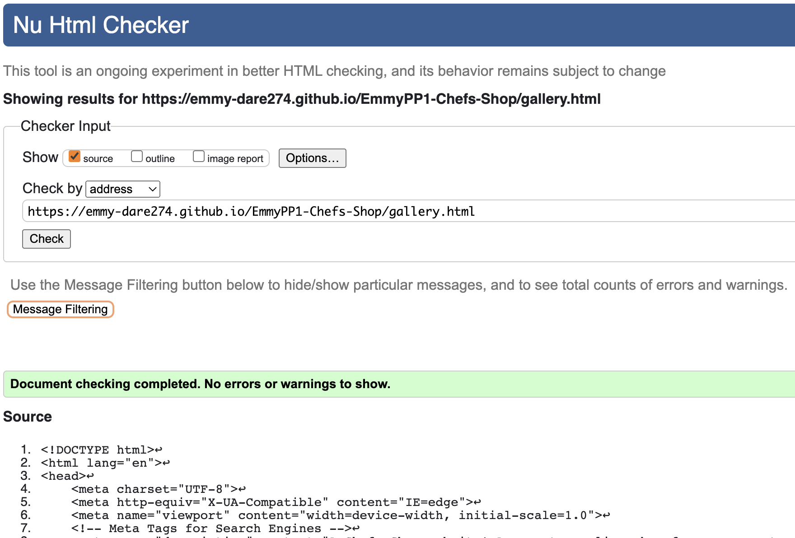

       

        - ##### Contact page

        - The official W3C validator tool did not detect any errors or warnings during the validation process.

       - [W3C Markup Validation Result |Contact page](https://validator.w3.org/nu/?showsource=yes&doc=https%3A%2F%2Femmy-dare274.github.io%2FEmmyPP1-Chefs-Shop%2Fcontactus.html) | Contact Us page validated without error.

        

         
Contact Us page result 
 
         

       

        - ##### CSS style

         - The official W3C validator tool did not detect any errors or warnings during the validation process.

         - [W3C Markup Validation Result |CSS](https://jigsaw.w3.org/css-validator/validator?uri=https%3A%2F%2Femmy-dare274.github.io%2FEmmyPP1-Chefs-Shop%2Findex.html&profile=css3svg&usermedium=all&warning=1&vextwarning=&lang=en) | CSS validated without error.

        

         
CSS result 
 
         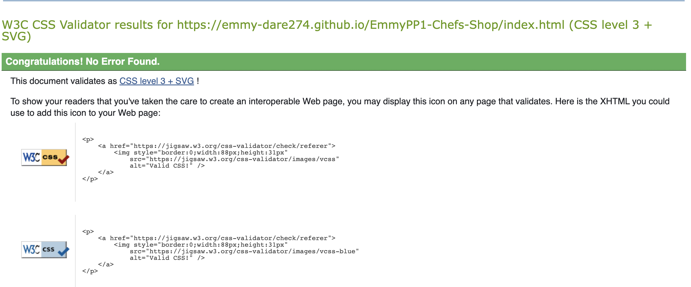

        

## LightHouse report

  - I have used Lighthouse in DevTools to run and analyze the functioning of the website and carry out an overall audit of the website. The results displayed for each page of the site indicate that the website is performing well, accessible, and the colors and selected fonts are readable and conventional.

  - ### Home page score

    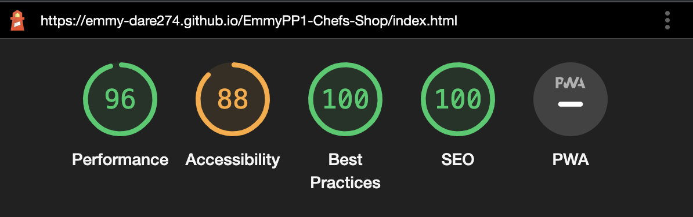

  - ### Gallery page score

    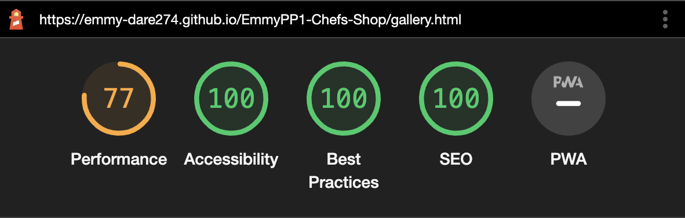

  - ### Contact Us page score

    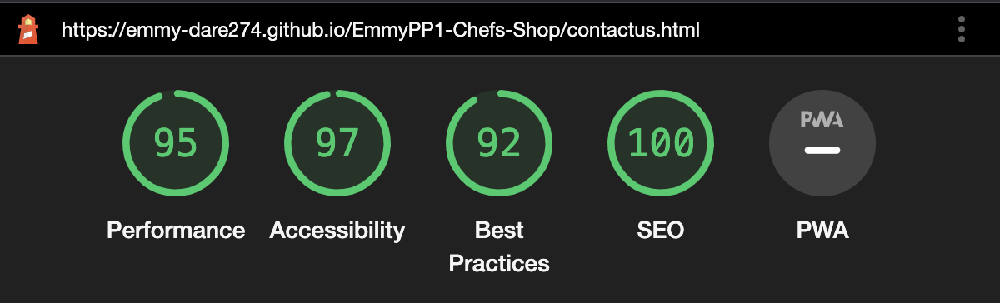

## Manual testing

| Feature | Action | Outcome | Tested | Passed | Comments |
| --- | --- | --- | --- | --- | --- |
| Navbar | | | | | |
| Home | Click on the "Home" link | The user is redirected to the main page | Yes | Yes | link working as intended |
| Gallery | Click on the "Gallery" link | The user is directed to the gallery page | Yes | Yes | link working as intended |
| Contact Us | Click on the "Contact Us" link | The user is directed to the 'Contact Us page | Yes | Yes | link working as intended |
| Footer | | | | | |
| Facebook icon in the footer | Click on the Facebook icon | The user is redirected to the Facebook page | Yes | Yes | link working as intended |
| Twitter icon in the footer | Click on the Twitter icon | The user is redirected to the Twitter page | Yes | Yes | link working as intended |
| YouTube icon in the footer | Click on the YouTube icon | The user is redirected to the YouTube page | Yes | Yes | link working as intended |
| Instagram icon in the footer | Click on the Instagram icon | The user is redirected to the Instagram page | Yes | Yes | link working as intended |
| Tik Tok icon in the footer | Click on the Tik Tok icon | The user is redirected to the Tik Tok page | Yes | Yes | link working as intended |
| LinkedIn icon in the footer | Click on the LinkedIn icon | The user is redirected to the LinkedIn page | Yes | Yes | link working as intended |
| Contact page | | | | | |
| First name input | Insert the first name | The first name is entered | Yes | Yes | If a user doesn't enter the first name, an error message appears |
| Last name input | Insert the last name | The last name is entered | Yes | Yes | If a user doesn't enter the last name, an error message appears |
| Email input | Insert an email | Email is entered | Yes | Yes | If a user doesn't enter the email, an error message appears. If a user enters an invalid email format, a message appears directing them on the allowed format. |
| "Send" button | Click on the "Send" button | The user is redirected to a response page | Yes | Yes | link working as intended |
| Response page | | | | | |
| Response message | The user will be automatically redirected to the main page in 10 seconds. | The user is redirected to the Home page | Yes | Yes | link working as intended |

---

## Test on browsers

  The website was tested on computers using the following browsers:
  - [Google Chrome](https://www.google.com/chrome/)
  - [Microsoft edge](https://www.microsoft.com/en-us/edge?form=MA13L0)
  - [Safari](https://www.apple.com/safari/)

## Test on devices
[Chrome DevTools](https://developer.chrome.com/docs/devtools/) was used to see how the site looks like on various devices like phones and tablets. Additionally, after deployment the website was tested on various mobile phones: iphone12, iphone SE, Samsung Galaxy Fold.

## Deployment

  ### Github Pages

  The website has been deployed to GitHub. The project was safely stored in Github.   

  - These are the steps taken to deploy this project. In the GitHub repository:
    - Go to Settings Tab
    - Then the GitHub pages
    - Select Branch main
    - Save
    - Visit the website by following the [link](https://emmy-dare274.github.io/EmmyPP1-Chefs-Shop/):
  

  ### Making a Local Clone

  - Log in to GitHub and find the GitHub Repository.
    - Click the Code dropdown menu.
    - You can either download the Zip file, unpackage locally and open an IDE or clone the repository using HTTPS, under "clone with https", copy the link.
    - Open Git Bash
    - Change the current working directory to the location where you want the cloned directore to be made
    - Type git clone (if it's VS Code, press cmd+shift+p for shortcut then click the URL) and then paste the URL you copied.
    - Press Enter. Your local clone will be created.

## Fixed Bugs

  - When I first deployed my project to GitHub pages for its live view on the web, I noticed that the cover image and video were not being displayed. I spent some time trying to figure out what went wrong. I inspected all of my code to see if there was a syntax error. In the end, I was able to solve the problem by realizing that the file path was the cause of the image not being displayed. I was using an absolute file path when it should have been a relative file path. After changing the file path to a relative file path, the problem was fixed.

  - While working on the project, I faced an issue with the Favicon icon not appearing on the Tab. I    spent a considerable amount of time trying to fix it. Initially, I almost deleted my code and started all over again. I checked for bugs and inspected every link tag added at the header section. I eventually realized that the image was too big and the file path was unconventional. After optimizing the image and adjusting the file path and size, the Favicon appeared on the Tab.

  - During the validation processes, other bugs were also fixed. I learned through the W3C CSS official site that Font-weight in CSS does not require a % (percentage), and padding-top, right, left, or bottom should not have more than one value. This led me to go back to my code and make the necessary adjustments to fix the styling errors and pass the validation testing stage. After fixing the bugs, I received a congratulatory message confirming that my codes were valid and accepted.

## Credits

  ### Inspiration Credits

  - #### Theme Colors & Webpage

    The Chefs-Shop Home page was inspired by [EtchPad](https://andodaryl.github.io/EtchPad/)

    The Gallery page and the Contact page section were inspired by a walkthrough project called [Love Running](https://emmy-dare274.github.io/Emmy-LoveRunning-project/)

    Some of the content of the webpage were inspired by [Chefspencil](https://www.chefspencil.com/the-best-20-cooking-websites/)

  - #### README Inspiration

    This is my first 'README' file, I have taken inspiration from the files of many other students who were generous enough to share their initial projects. In particular, I found the listed 'README' to be very helpful.

    [Kera Cudmore](https://github.com/kera-cudmore/readme-examples#links)

    [Laure Piechaczyk](https://github.com/LaurePiechaczyk/project1_code_institute_Laure_Piechaczyk/blob/main/README.md#)

    [Code Institute](https://github.com/Code-Institute-Org/ci-full-template)

  - #### Images Credits

    Both the Home page cover images and the Gallery images were taken from [Pexels](https://www.pexels.com/) and [Rawpixel](https://www.rawpixel.com/) while others were taken from [Unsplash](https://unsplash.com/).

## Conclusion

  Throughout this project, my understanding of HTML and CSS has been deepened and consolidated. I believe that the project reflects my strong foundations in these languages. 

  One key lesson I learned from this project is that it's essential to have a clear and comprehensive overview of the project before beginning to code, as well as to maintain this overview throughout the project's development. I hope to apply this insight to the start of my next project and achieve a smoother progression. 

  Overall, I truly enjoyed the process of coding this project, which aimed to integrate the understanding of HTML and CSS. My primary goal was to learn, and I believe that I have gained a great deal of knowledge and experience as a result.

## Acknowledgements

  - I would like to express my gratitude to my mentor, [Rohit Sharma](https://github.com/rohit0286), for providing me with the direction to initiate the project, for guiding me throughout the project, for suggesting new features to implement, and for giving me feedback on my work. 

  - In addition, I am thankful to the supportive Slack community and friends for clarifying certain concepts, sharing tips and links, and always being ready to assist me with coding-related issues. Finally, I'd like to express my appreciation to [Code Institutes](https://codeinstitute.net/) for providing the necessary tools and guide to accomplish this project.

  - I would like to extend my appreciation to wonderful [Dave Gray](https://www.freecodecamp.org/news/the-css-flexbox-handbook/) from FreeCodeCamp for his pinpoint YouTube Tutorial on CSS Full Guide and JavaScript.

  - Finally, I am grateful to God for providing me with the strength and the right mindset to complete this project.
